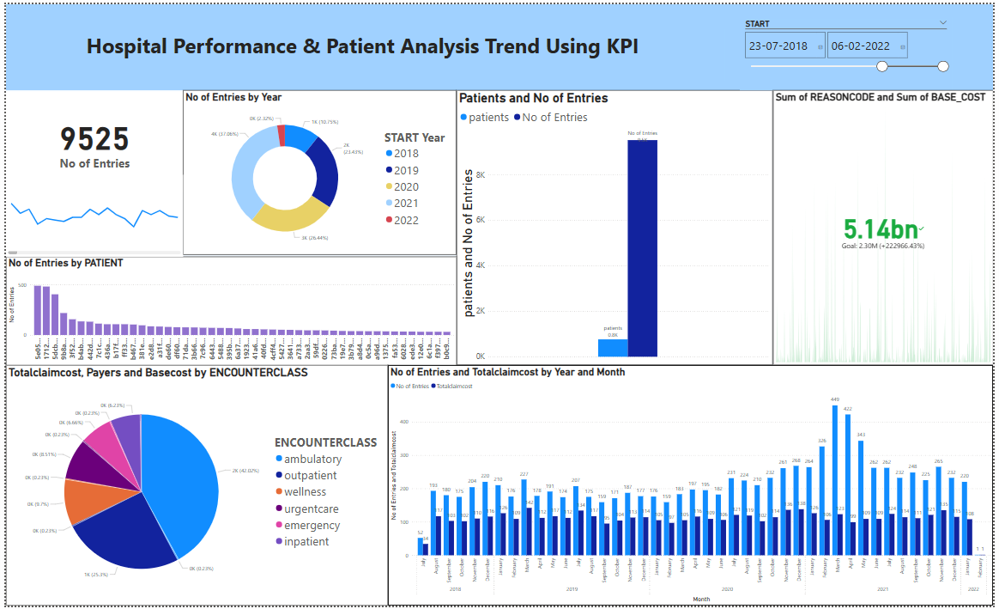
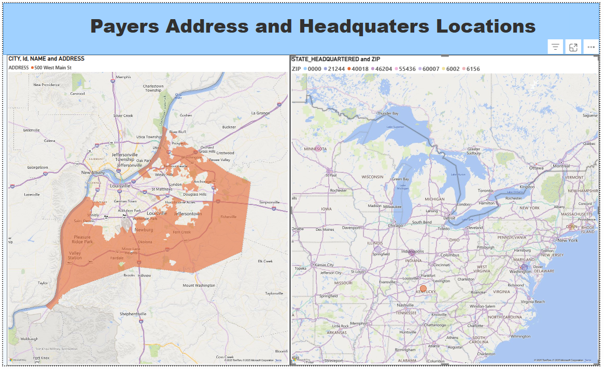
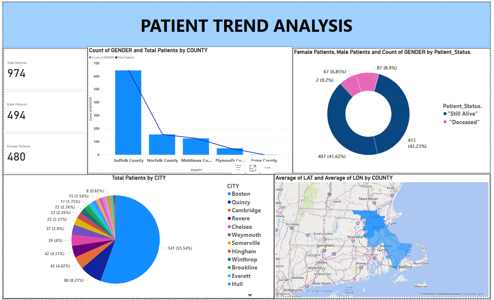
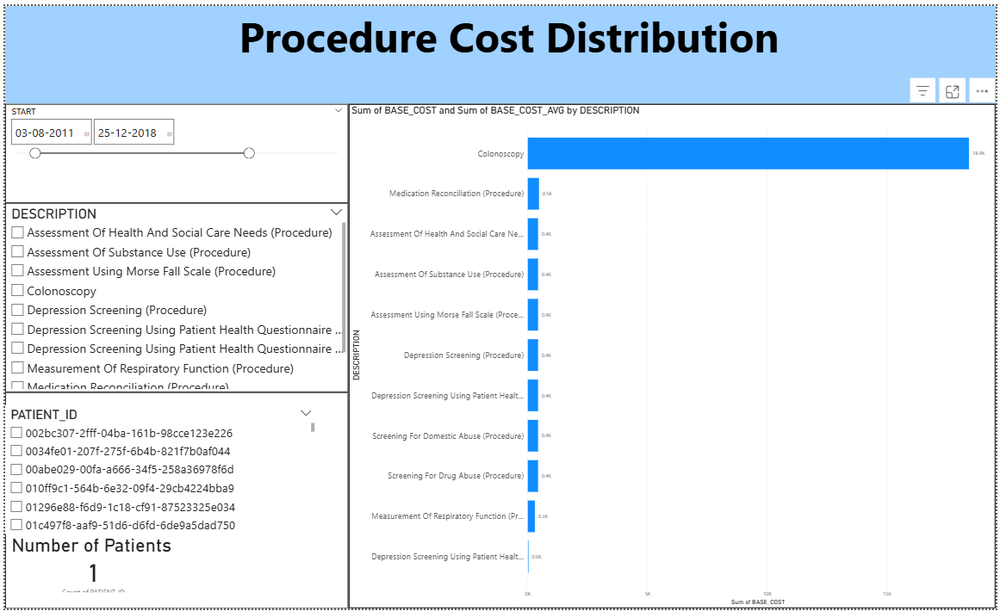

# 🏥 Hospital Performance & Patient Analysis Dashboard (Power BI)

This project presents a comprehensive Power BI dashboard designed to analyze hospital performance, claim costs, payer locations, patient demographics, and procedure cost distribution. The dashboard contains **four pages**, each focused on delivering actionable healthcare insights.

---

## 📄 **Page 1 – Claim Cost Overview**

This page provides a complete financial and claim-based summary:  
- Total Claim Cost  
- Payers & Base Cost by Encounter Class  
- Total Number of Entries  
- Claim Cost by Year–Month  
- Patient Entry Count  

---

## 🌍 **Page 2 – Payers Address & Headquarters Map**

This page visually maps payer locations:  
- Payers' Addresses and Headquarters  
- Highlighted Service Coverage Areas  
- Geographic distribution analysis  

---

## 👥 **Page 3 – Patient Trend Analysis**

This page explores patient demographics and trends:  
- Gender Distribution (Male vs Female)  
- Total Patients by Country  
- Total Patients by City  
- Female vs Male Patient Count  
- Gender Count by Patient Status  

---

## 💰 **Page 4 – Procedure Cost Distribution**

This page focuses on cost insights:  
- Sum of Base Cost by Procedure Description  
- Average Base Cost by Procedure Description  
- Identifies costly procedures & financial patterns  

---

## 🛠️ Tools Used
- Power BI Desktop  
- Power Query  
- DAX Measures  
- Hospital & Claims Dataset  

---

## 📬 Contact  
**Shrutik Vankundre**  
📧 shrutikvankundre1008@gmail.com  
🔗 GitHub: https://github.com/Shrutik1008
